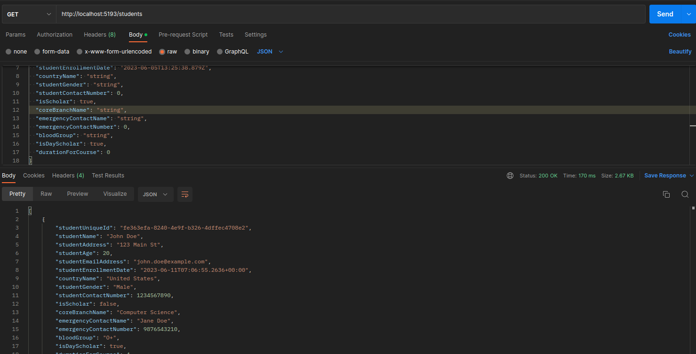

# University REST API

This is a RESTful API for managing student, teacher, grade, and course data for a university.

## Technologies Used

- .NET Core
- ASP.NET Core Web API
- Entity Framework Core
- MYSQL Server
- React (optional, if you're building a React frontend)

## Getting Started

To get started with the University API, follow these steps:

1. Clone the repository:

    ```shell
   git clone git@github.com:Nix-code/University.Catalog.RestAPI.git

2. Install the required dependencies:

    ```shell
    dotnet restore

3. Configure the database connection in appsettings.json or appsettings.Development.json

4. Run the API:

    ```shell
    dotnet run

5. The API will start running on **https://localhost:port**

# API Endpoints

The University API provides the following endpoints for accessing student's detail:

- GET /api/students: Get all students

- GET /api/students/{id}: Get a specific student by ID

- POST /api/students: Create a new student

- PUT /api/students/{id}: Update an existing student

- DELETE /api/students/{id}: Delete a student

Similar endpoints are available for teachers, grades, and courses

## Directory Tree
```
└── University
    ├── BusinessLogic
    │   └── ModelsDtos
    │       └── Student.Model.Dto
    │           ├── CreateStudentRecordDto.cs
    │           ├── StudentEntityDto.cs
    │           └── UpdateStudentRecordDto.cs
    ├── DataAccess
    │   ├── Entities
    │   │   ├── Course.Entity
    │   │   │   └── CourseEntity.cs
    │   │   ├── Grade.Entity
    │   │   │   └── GradeEntity.cs
    │   │   ├── Student.Entity
    │   │   │   └── StudentEntity.cs
    │   │   └── Teacher.Entity
    │   │       └── TeacherEntity.cs
    │   └── Persistence
    │       └── StudentPersistence
    │           ├── DbContext.cs
    │           └── Repositories
    │               ├── IStudentRepository.cs
    │               └── StudentRepository.cs
    ├── Helper
    │   └── StudentHelper.cs
    └── Presentation
        └── Controllers
            ├── Course.Controller
            │   └── CourseController.cs
            ├── Grade.Controller
            │   └── GradeController.cs
            ├── Student.Controller
            │   └── StudentController.cs
            └── Teacher.Controller
                └── TeacherController.cs

```
## Demo




## Contributing
Contributions are welcome! If you have any suggestions, bug reports, or feature requests, please open an issue or submit a pull request.

## License
This project is licensed under the **MIT License**.
